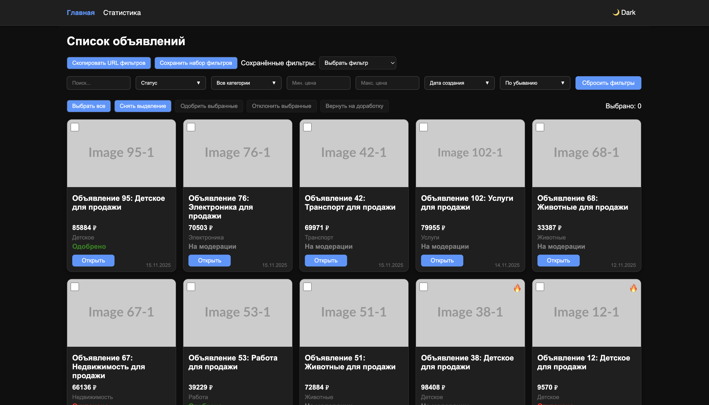
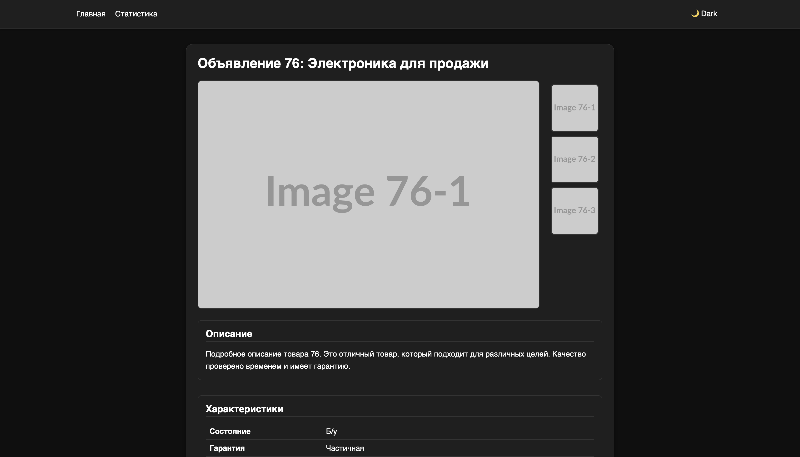

# Avito Moderation Dashboard

**Описание:**  
Проект представляет собой веб-приложение для мониторинга и осуществления модерации объявлений. Сервис позволяет получать статистику, строить графики активности, решений и категорий объявлений.

---

## Скриншоты

Главная страница:  


Второй экран / пример графиков:  


---

## Используемые технологии

**Frontend:**  
- **React** — библиотека для построения интерфейсов  
- **Vite** — быстрый сборщик и dev-сервер  
- **Axios** — для запросов к backend API  
- **Framer Motion** — анимации элементов интерфейса  
- **Vitest** (опционально) — для unit-тестов  
- **html2canvas & jsPDF** (опционально) — экспорт страниц и графиков в PDF  

**Линтинг и форматирование:**  
- **ESLint** — проверка кода на ошибки и стиль  
- **Prettier** — автоформатирование кода  

**Контейнеризация:**  
- **Docker & Docker Compose** — упрощённый запуск фронтенда и бэкенда в контейнерах  

---

## Запуск проекта

### Через Docker Compose

1. Собрать образы и запустить контейнеры:
```bash
docker compose up --build
